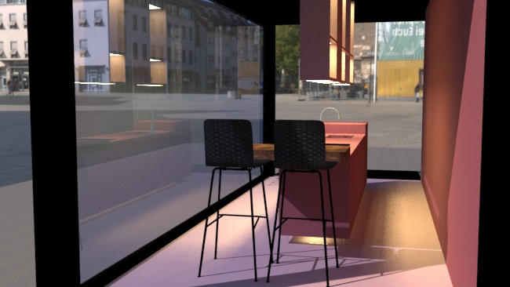

 


 


Aquí se escribe lo que vaya a ir en el proyecto

1. Se le puede dar formato usando *markdown*
2. SE puede añadir imagenes
3. You can include syntax highlighted code

#La forma de escribir
##subtitulos
###mas pequeño

ahora lo miro esto es texto normal. <br/>
linea en vlaco


```js
console.log(`Hello world, 1 + 1 = ${1 + 1}`);
```
