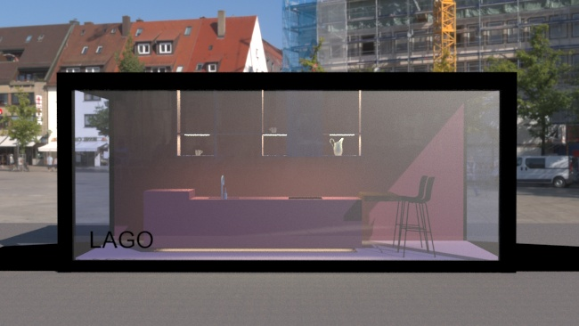
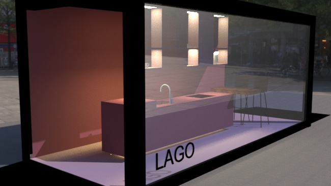

    

        

          
        

        

          
        

    

    

        

          
        

        

          
        

    

    

        

          
        

        

          
        

    

Este proyecto consiste en proyectar y distribuir un espacio de exposición (showroom) a una feria para una casa de cocinas, de 18 m2. La función del ambiente construido será la de cocina-comedor de un prototipo  de vivienda de dimensiones reducidas.

El concepto que quería reflejar en este proyecto es principalmente el estilo minimalista, utilizando elementos mínimos y básicos. Simplificando todo a lo esencial,  eliminando cualquier elemento sobrante y poder generar en la gente una experiencia, un sentido a partir de lo mínimo. Por eso utilizo colores puros y líneas simples, dándole mucho protagonismo  al color.

Para este proyecto elegí los muebles de la casa Lago, ya que me parecen muy interesantes estéticamente y era lo que buscaba para cumplir con el concepto y la idea del proyecto.
El modelo que elegí  es la Cocina 36e8 ya que tiene un estilo minimalista, sus muebles aligeran la percepción de estorbos de las cocinas tradicionales
