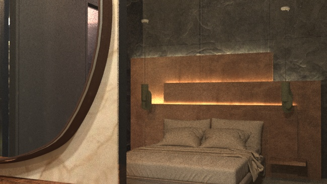
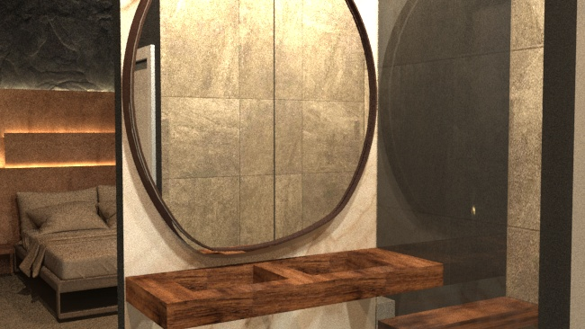
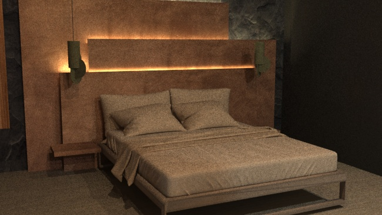
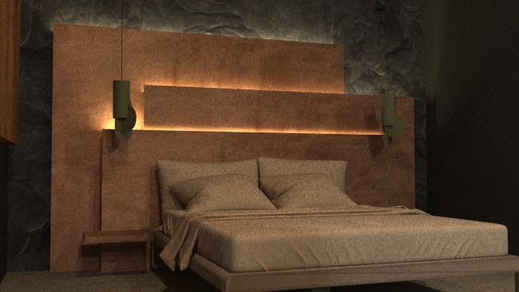

    

        

          
        

        

          
        

    

    

        

          
        

        

          
        

    

El proyecto consiste en el diseño y distribución del espacio de una habitación de hotel, de categoría 4-5 estrellas, de perfil urbano.
La actividad pretende reflexionar sobre la importancia de los materiales de revestimiento y pavimentos, el mobiliario y la iluminación en el proyecto de interiorismo.

En el caso de este ambiente el balance ideal de materiales como maderas, piedras, mármoles, representaban lo que quería conseguir con mi diseño. A su vez el uso de colores oscuros y sobrios son los correctos para el ambiente que quiero crear.
Espacio armónico en el que se conjugan la simplicidad de las líneas con la textura de los materiales. Creando un ambiente para desconectar del estrés diario con un toque de alto standing.
